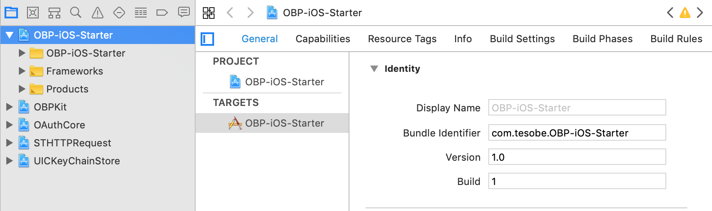

# OBP-iOS-Starter 

A minimal functioning iOS starter app to copy and modify, that demonstrates log-in to an [OBP][] server and a first [API][] call using [OBPKit][]. See [OBPKit][] for full usage guidance, and [HelloOBP-iOS][] for more example usage, and the API Explorer at the OBP server you are using.

### Install

1.	Clone this repo

1.	Break the link by running `git remote remove origin` (replace with your own remote).

1.	Get third party libraries
	1.	If you are happy using [Carthage][] ([install][Carthage-install]), the project is ready, and you just need to run `carthage update --platform iOS --no-build --no-use-binaries`.
	1.	If you prefer to use [CocoaPods][] ([install][CocoaPods-install]), checkout the `use_cocoapods` branch of this repo, update `master` and complete the install as follows
		```sh
		$ git checkout use_cocoapods
		$ git branch -f master use_cocoapods
		$ git checkout master
		$ pod install
		```

1.	Replace the credentials in `AppDelegate.swift` with those you obtain from the Get API Key link at the OBP server you are using.
	1.	Rename. Decide on your app name, then in the project file change the project and target names from OBP-iOS-Starter to _Your-App-Name_ and the bundle id from com.tesobe.OBP-iOS-Starter to _your.reverse.domain_._Your-App-Name_
	
	1.	Make a note of the default redirect URL you will need when registering your app as an API consumer. If you followed the previous step literally, it would be `x-your.reverse.domain.your-app-name://callback`, i.e. the scheme is the lowercased bundle id, prefixed with `x-` — more on this at [callback schemes][OBPKit-Callback-Schemes]. It's important to get this right, as it is verified as part of OAuth handshake; making a mistake here is a common cause of getting _401 unauthorised_ responses.
	1.	Register your app by following the Get API Key link at the OBP server you are using, and using the redirect URL from the previous step. Save the registration result page as a PDF and retain — you will need it if you want to change the redirect URL at some future point.
	1.	In `AppDelegate.swift` update the key and secret to yours, and update the server URLs if necessary.


[OBP]: http://www.openbankproject.com
[OBPKit]: https://github.com/OpenBankProject/OBPKit-iOSX
[OBPKit-Callback-Schemes]: https://github.com/OpenBankProject/OBPKit-iOSX#callback-schemes
[API]: https://github.com/OpenBankProject/OBP-API/wiki
[DirectLogin]: https://github.com/OpenBankProject/OBP-API/wiki/Direct-Login
[HelloOBP-iOS]: https://github.com/OpenBankProject/Hello-OBP-OAuth1.0a-IOS
[HelloOBP-Mac]: https://github.com/OpenBankProject/Hello-OBP-OAuth1.0a-Mac
[Carthage]: https://github.com/Carthage/Carthage/blob/master/README.md
[Carthage-install]: https://github.com/Carthage/Carthage/blob/master/README.md#installing-carthage
[CocoaPods]: https://github.com/CocoaPods/CocoaPods/blob/master/README.md
[CocoaPods-install]: http://guides.cocoapods.org/using/getting-started.html#installation
